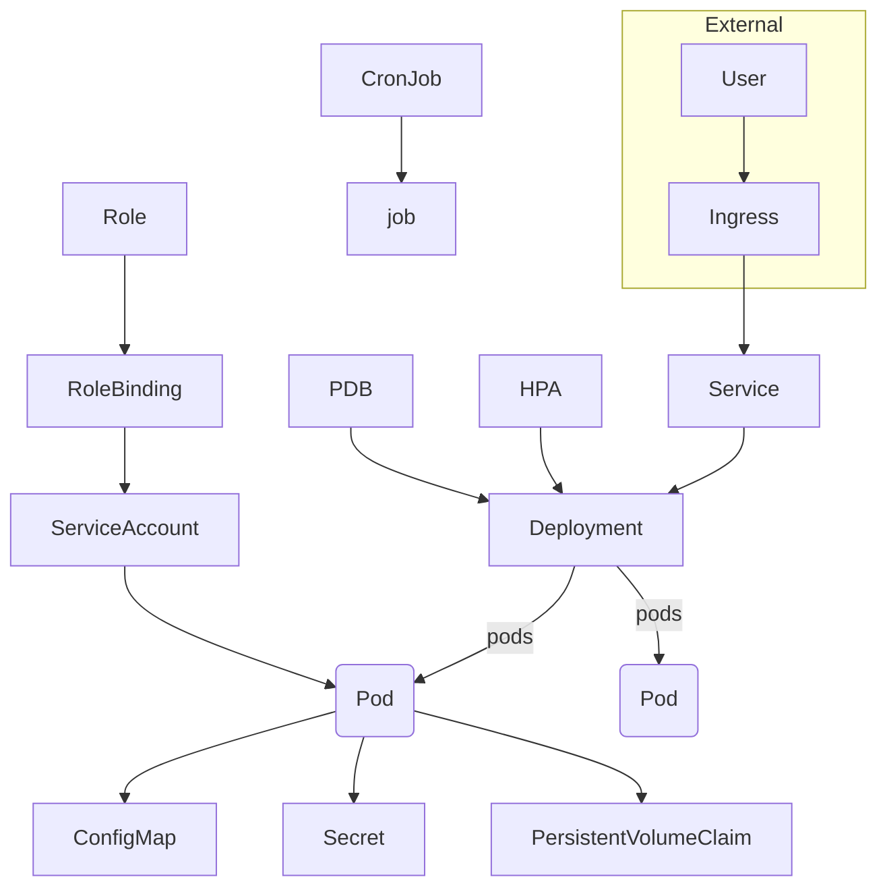

# Helm Chart

This project contains the base structure for packaging and deploying a Kubernetes application using **Helm**.

This Helm chart provides a Kubernetes deployment structure for a generic application. It includes templates for almost every common Kubernetes resource, allowing easy configuration via the `values.yaml` file.

## 🚀 What is Helm?

Helm is a **package manager for Kubernetes**. It simplifies deployment, configuration, and versioning of applications by using “**charts**” – pre-configured Kubernetes resources.

## 📦 Chart Structure

```plain
app/
├── Chart.yaml
├── values.yaml
└── templates/
    ├── _helpers.tpl
    ├── deployment.yaml
    ├── service.yaml
    ├── ingress.yaml
    ├── configmap.yaml
    ├── secret.yaml
    ├── hpa.yaml
    ├── pvc.yaml
    ├── job.yaml
    ├── cronjob.yaml
    ├── pdb.yaml
    ├── serviceaccount.yaml
    ├── role.yaml
    └── rolebinding.yaml
```

## ⚙️ Template Explanations

### 1. Deployment

Defines how your app is deployed and scaled.

```yaml
replicaCount: 2
```

### 2. Service

Exposes the deployment to the network (ClusterIP, NodePort, or LoadBalancer).

```yaml
service:
  type: ClusterIP
  port: 80
```

### 3. Ingress

Handles external access using DNS and path rules.

```yaml
ingress:
  enabled: true
  host: "example.com"
```

### 4. ConfigMap

Stores non-sensitive configuration data as key-value pairs.

```yaml
config:
  myConfigKey: "some-value"
```

### 5. Secret

Stores sensitive data like passwords in base64.

```yaml
secret:
  mySecretKey: "c2VjcmV0"  # base64 of 'secret'
```

### 6. HorizontalPodAutoscaler

Automatically scales pods based on CPU usage.

```yaml
hpa:
  enabled: true
  minReplicas: 1
  maxReplicas: 5
```

### 7. PersistentVolumeClaim

Defines a volume claim for persistent storage.

```yaml
pvc:
  storage: "1Gi"
```

### 8. Job

Runs one-off tasks (e.g., batch jobs).
No values required by default.

### 9. CronJob

Schedules jobs at regular intervals.

```yaml
cron:
  schedule: "*/5 * * * *"
```

### 10. PodDisruptionBudget

Ensures minimum pods are always available during voluntary disruptions.

```yaml
pdb:
  enabled: true
```

### 11. ServiceAccount

Defines a Kubernetes service account for role-based access.

### 12. Role and RoleBinding

Manages RBAC permissions for the ServiceAccount.

## ✅ Best Practices

- **Use `.Values` consistently** to allow external configuration.
- **Keep secrets out of `values.yaml`** in Git — use encrypted secrets.
- **Use `_helpers.tpl`** to centralize naming conventions.
- **Scope permissions tightly** using Role/RoleBinding.
- **Enable Ingress/HPA/PDB** only when needed to reduce cluster load.
- **Use semantic versioning** in `Chart.yaml`.

## 🗺️ Architecture Diagram (Mermaid)



## 🧪 Usage

```bash
# Lint the chart (check for errors)
helm lint helm/app

# Render templates locally (see what will be deployed)
helm template helm/app

# Install the chart (initial deployment)
helm install app helm/app

# Upgrade the release (apply new values or changes)
helm upgrade app helm/app

# Uninstall the release
helm uninstall app

# Package the chart
helm package helm/app

# Install using a specific values file
helm install app helm/app -f values.yaml
```

---

### Key Components

- **Chart.yaml** – Metadata about the chart (name, version, etc.)
- **values.yaml** – The default configuration values for the chart.
- **templates/** – Kubernetes resource templates (yaml with Go templating).
- **charts/** – Directory to hold any dependent charts.
