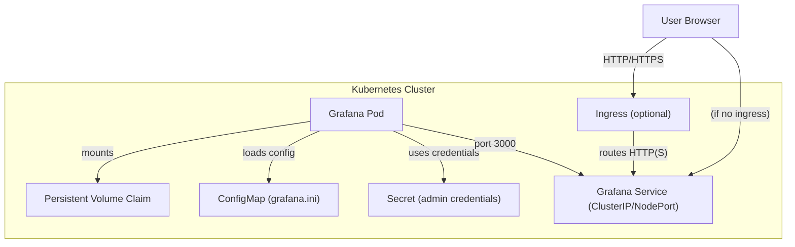

# Grafana Helm Chart

This directory contains a Helm chart for deploying Grafana on Kubernetes. The chart includes configuration for persistent storage, admin credentials, service exposure, and optional ingress.

## Structure

```plain
helm/services/grafana/
├── Chart.yaml
├── values.yaml
└── templates/
    ├── grafana.yaml
    ├── service.yaml
    ├── ingress.yaml
    ├── secret.yaml
    ├── configmap.yaml
    ├── pvc.yaml
    └── _helpers.tpl
```

## 🗺️ Architecture Overview



## Components

### 1. Grafana Deployment

- **Deployment**: Defined in `templates/grafana.yaml`.
  - Deploys Grafana using the image specified in `values.yaml` (default: `grafana/grafana:latest`).
  - Sets admin credentials from a Kubernetes Secret.
  - Mounts persistent storage and configuration from a ConfigMap.
- **Persistent Storage**: Configured via `templates/pvc.yaml` and enabled by default.
- **Configuration**: Custom `grafana.ini` provided by a ConfigMap (`configmap.yaml`).

### 2. Service

- **Service**: Defined in `templates/service.yaml`.
  - Exposes Grafana on port 80 (mapped to container port 3000).
  - Default type is `ClusterIP`, configurable via `values.yaml`.

### 3. Ingress (Optional)

- **Ingress**: Defined in `templates/ingress.yaml`.
  - Can be enabled to expose Grafana externally.
  - Hostname is configurable (default: `grafana.example.com`).

### 4. Secrets

- **Secret**: Defined in `templates/secret.yaml`.
  - Stores admin username and password for Grafana.

### 5. Helpers

- **_helpers.tpl**: Contains template helpers for consistent resource naming.

## Configuration

The main configuration options are in `values.yaml`:

- **grafana.image**: Grafana Docker image to use.
- **grafana.secret.user/password**: Admin credentials.
- **grafana.persistence.enabled/size**: Enable and size persistent storage.
- **grafana.service.type**: Service type (`ClusterIP`, `NodePort`, etc.).
- **grafana.ingress.enabled/host**: Enable ingress and set hostname.

## Usage

### Prerequisites

- [Helm](https://helm.sh/) installed
- A running Kubernetes cluster

### Deploying the Chart

1. Navigate to the `helm/services/grafana` directory:

   ```sh
   cd helm/services/grafana
   ```

2. Install the chart:

   ```sh
   helm install <release-name> <chart-directory>
   helm install grafana .
   ```

### Accessing Grafana

- If using a `ClusterIP` service, use port-forwarding:

  ```sh
  kubectl port-forward svc/my-grafana 3000:80
  ```

  Then open [http://localhost:3000](http://localhost:3000) in your browser.

- If ingress is enabled, access Grafana via the configured hostname.

### Default Credentials

- **Username**: `admin`
- **Password**: `admin`
  (Change these in `values.yaml` for security.)

## Notes

- This chart is intended for development and demonstration purposes.
- For production, review and update resource limits, storage, and security settings.
