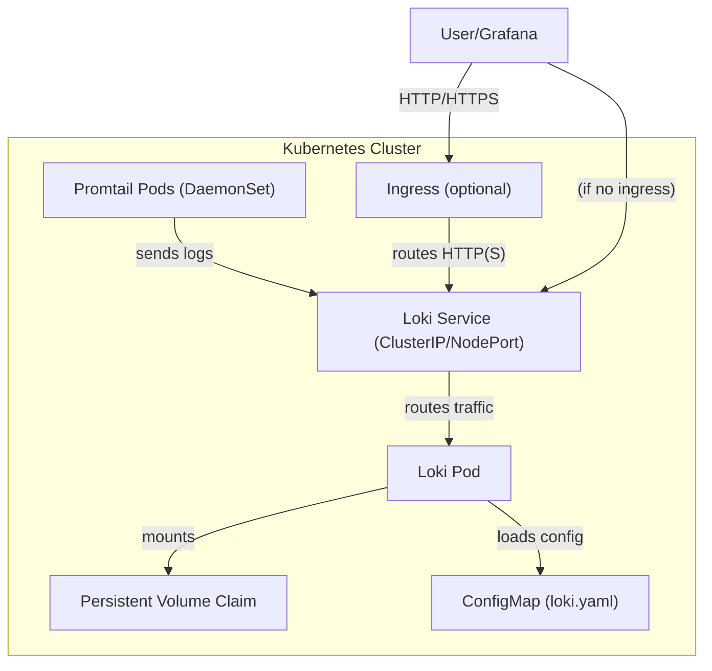

# Loki Helm Chart

This directory contains a Helm chart for deploying Loki on Kubernetes. The chart includes configuration for persistent storage, service exposure, optional ingress, and integration with Promtail for log collection.

## The Role of Promtail

Loki is a log aggregation system: it is designed to store and allow you to query logs. However, Loki itself does not actively collect logs from your applications. For that, you need an **agent**.

**Promtail** is the official agent purpose-built for Loki. Its primary jobs are to:

1. **Discover** log sources (like Kubernetes pods running on a node).
2. **Attach labels** (metadata) to the log streams, which is crucial for efficient querying in Loki.
3. **Push** the collected log streams to the Loki instance.

In this chart, Promtail is deployed as a `DaemonSet`. This ensures that a Promtail pod runs on each node in the cluster, allowing it to access and forward logs from all applications. While other agents can be configured to send logs to Loki, Promtail is highly optimized for this ecosystem.

## Structure

```plain
helm/services/loki/
├── Chart.yaml
├── values.yaml
└── templates/
    ├── loki.yaml
    ├── service.yaml
    ├── ingress.yaml
    ├── configmap.yaml
    ├── pvc.yaml
    ├── promtail.yaml
    ├── promtail-configmap.yaml
    ├── promtail-cluster-role.yaml
    └── _helpers.tpl
```

## 🗺️ Architecture Overview



## Components

### 1. Loki Deployment

- **Deployment/StatefulSet**: Defined in `templates/loki.yaml`.
  - Deploys Loki using the image specified in `values.yaml` (default: `grafana/loki:latest`).
  - Mounts persistent storage and configuration from a ConfigMap.
- **Persistent Storage**: Configured via `templates/pvc.yaml` and enabled by default.
- **Configuration**: Custom `loki.yaml` provided by a ConfigMap (`configmap.yaml`).

### 2. Service

- **Service**: Defined in `templates/service.yaml`.
  - Exposes Loki on port 3100.
  - Default type is `ClusterIP`, configurable via `values.yaml`.

### 3. Ingress (Optional)

- **Ingress**: Defined in `templates/ingress.yaml`.
  - Can be enabled to expose Loki externally.
  - Hostname is configurable (default: `loki.example.com`).

### 4. Promtail (Optional)

- **DaemonSet**: Defined in `templates/promtail.yaml`.
  - Deploys the Promtail agent to collect logs from all nodes if enabled in `values.yaml`.
  - Requires RBAC permissions to read pod logs.

### 5. Helpers

- **_helpers.tpl**: Contains template helpers for consistent resource naming.

## Configuration

The main configuration options are in `values.yaml`:

- **loki.image**: Loki Docker image to use.
- **loki.persistence.enabled/size**: Enable and size persistent storage.
- **loki.service.type**: Service type (`ClusterIP`, `NodePort`, etc.).
- **loki.ingress.host**: Ingress hostname.
- **promtail.enabled**: Enable or disable the Promtail DaemonSet.

## Usage

### Prerequisites

- Helm installed
- A running Kubernetes cluster

### Deploying the Chart

1. Navigate to the `helm/services/loki` directory:

   ```sh
   cd helm/services/loki
   ```

2. Install the chart:

   ```sh
   helm install <release-name> <chart-directory>
   helm install loki .
   ```

### Accessing Loki

- If using a `ClusterIP` service, use port-forwarding:

  ```sh
  kubectl port-forward svc/my-loki 3100:3100
  ```

  You can then configure Grafana to use `http://localhost:3100` as the Loki data source URL.

- If ingress is enabled, access Loki via the configured hostname.

## Notes

- This chart is intended for development and demonstration purposes.
- For production, review and update resource limits, storage, and security settings.
