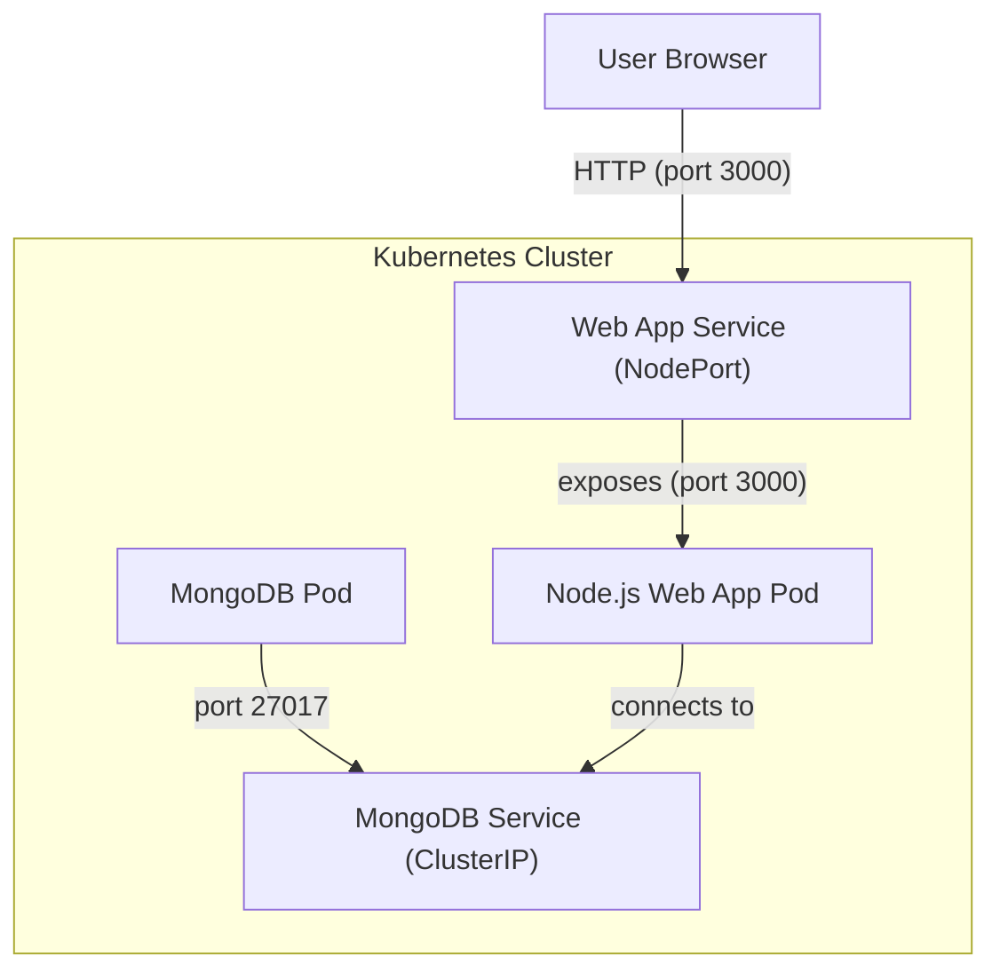

# MongoDB Helm Chart

This directory contains a Helm chart for deploying MongoDB along with a simple Node.js web application (`web-app`) that interacts with the MongoDB instance.

## Structure

```plain
helm/services/mongodb/
├── Chart.yaml
├── values.yaml
├── templates/
│   ├── mongodb.yaml
│   └── _helpers.tpl
└── web-app/
    ├── Dockerfile
    ├── package.json
    ├── server.js
    └── views/
        └── index.ejs
```

## 🗺️ Architecture Overview



## Components

### 1. MongoDB Deployment

- **Deployment & Service**: Defined in `templates/mongodb.yaml`.
  - Deploys a single MongoDB pod using the official `mongo:latest` image.
  - Exposes MongoDB on port 27017 via a Kubernetes Service.
- **Helpers**: `templates/_helpers.tpl` provides template functions for naming resources.

### 2. Web App (`web-app`)

- **Description**: A Node.js application using Express and EJS, allowing users to add, update, delete, and search items in the MongoDB database.
- **Files**:
  - `server.js`: Main server logic, connects to MongoDB, and provides CRUD endpoints.
  - `views/index.ejs`: EJS template for the UI.
  - `Dockerfile`: Containerizes the app for deployment.
  - `package.json`: Lists dependencies (`express`, `mongodb`, `ejs`).
- **Default MongoDB URI**: The app connects to the MongoDB service using the internal DNS name `mongodb-mongodb:27017`.

## Usage

### Prerequisites

- [Helm](https://helm.sh/) installed
- A running Kubernetes cluster

### Deploying the Chart

1. Navigate to the `helm/services/mongodb` directory:

   ```sh
   cd helm/services/mongodb
   ```

2. Install the chart:

   ```sh
   helm install <release-name> <chart>
   helm install v1 helm/services/mongodb
   ```

   This will deploy both MongoDB (if included in your templates).

### Accessing the Web App

- The web-app listens on port 3000 inside its container. You may need to expose it using a Kubernetes `Service` or `Port Forward`:

  ```sh
  eval $(minikube docker-env)
  
  docker build -t <account>/mongodb-app .
  docker push <account>/mongodb-app   

  kubectl run mongo-web-app \
    --image=<account>/mongodb-app  \
    --restart=Never \
    --port=3000

  kubectl expose pod mongo-web-app --type=NodePort --port=3000

  minikube service mongo-web-app or kubectl port-forward svc/mongo-web-app 3000:3000
  ```

- Open [http://localhost:3000](http://localhost:3000) in your browser.

## Configuration

- The `values.yaml` file is currently empty. You can add custom values as needed for further configuration.
- The MongoDB deployment uses default settings. For production, consider customizing resource limits, storage, and authentication.

## Notes

- This chart is intended for development and demonstration purposes.
