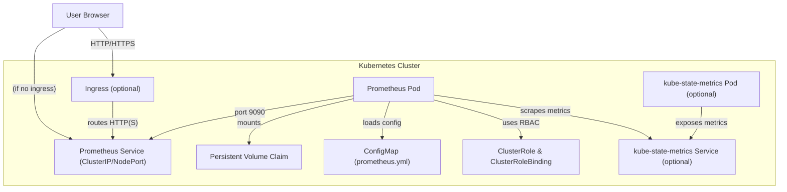

# Prometheus Helm Chart

This directory contains a Helm chart for deploying Prometheus on Kubernetes. The chart includes configuration for persistent storage, RBAC, service exposure, optional ingress, and integration with kube-state-metrics.

## Structure

```plain
helm/services/prometheus/
├── Chart.yaml
├── values.yaml
└── templates/
    ├── prometheus.yaml
    ├── service.yaml
    ├── ingress.yaml
    ├── configmap.yaml
    ├── pvc.yaml
    ├── cluster-role.yaml
    └── _helpers.tpl
```

## 🗺️ Architecture Overview



## Components

### 1. Prometheus Deployment

- **Deployment**: Defined in `templates/prometheus.yaml`.
  - Deploys Prometheus using the image specified in `values.yaml` (default: `prom/prometheus:latest`).
  - Mounts persistent storage and configuration from a ConfigMap.
  - Supports retention configuration.
- **Persistent Storage**: Configured via `templates/pvc.yaml` and enabled by default.
- **Configuration**: Custom `prometheus.yml` provided by a ConfigMap (`configmap.yaml`).

### 2. Service

- **Service**: Defined in `templates/service.yaml`.
  - Exposes Prometheus on port 9090.
  - Default type is `ClusterIP`, configurable via `values.yaml`.

### 3. Ingress (Optional)

- **Ingress**: Defined in `templates/ingress.yaml`.
  - Can be enabled to expose Prometheus externally.
  - Hostname is configurable (default: `prometheus.example.com`).

### 4. RBAC

- **ClusterRole & ClusterRoleBinding**: Defined in `templates/cluster-role.yaml`.
  - Grants Prometheus permissions to access Kubernetes resources.

### 5. Kube-State-Metrics (Optional)

- **Deployment & Service**: Included in `prometheus.yaml` and `service.yaml` if enabled in `values.yaml`.
  - Provides additional Kubernetes metrics for Prometheus to scrape.

### 6. Helpers

- **_helpers.tpl**: Contains template helpers for consistent resource naming.

## Configuration

The main configuration options are in `values.yaml`:

- **prometheus.image**: Prometheus Docker image to use.
- **prometheus.retention**: Data retention period.
- **prometheus.persistence.enabled/size**: Enable and size persistent storage.
- **prometheus.service.type**: Service type (`ClusterIP`, `NodePort`, etc.).
- **prometheus.ingress.host**: Ingress hostname.
- **kubeStateMetrics.enabled**: Enable or disable kube-state-metrics.

## Usage

### Prerequisites

- [Helm](https://helm.sh/) installed
- A running Kubernetes cluster

### Deploying the Chart

1. Navigate to the `helm/services/prometheus` directory:

   ```sh
   cd helm/services/prometheus
   ```

2. Install the chart:

   ```sh
   helm install <release-name> <chart-directory>
   helm install prometheus .
   ```

### Accessing Prometheus

- If using a `ClusterIP` service, use port-forwarding:

  ```sh
  kubectl port-forward svc/my-prometheus 9090:9090
  ```

  Then open [http://localhost:9090](http://localhost:9090) in your browser.

- If ingress is enabled, access Prometheus via the configured hostname.

## Notes

- This chart is intended for development and demonstration purposes.
- For production, review and update resource limits, storage, and security settings.
